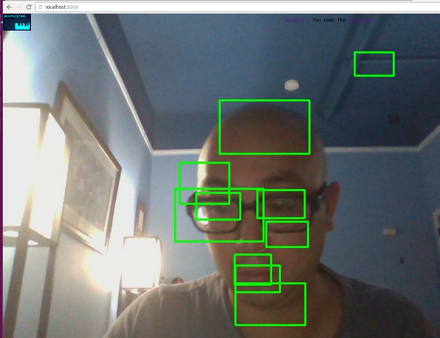

## Python videostreams for facial detection & biometrics

Use video streams to improve OpenCV detection of faces and with biometric markers.      

## Challenge and Approach

Our approach for satisfying this challenge was to:

- Utilize the computer's webcam to detect bounding boxes for eyes, nose, and mouth.  Once the bounding region has been assigned with machine learning, the biometric marker is compared against a mathematical predictive model determine improved facial recognition detection. 

## Team Members

Our team is comprised of:

- [@loudest](https://github.com/loudest) - README.md writer, took the Billpil in the matrix and spent 3 days at [VR Hackathon - Seattle](http://vrhackathon.com/seattle.html) writing this

## Technologies, APIs, and Datasets Utilized

We made use of:
- [Flask](http://flask.pocoo.org/) To render local host and video streams
- [OpenCV](http://opencv.org/) For video analysis and facial detection
- [openbr](http://openbiometrics.org/) biometrics markers and using machine learning to improve accuracy

## Contributing

In order to build and run our app:

1. [Deploying server-side code] server/ are Python server side Flask code to run everything
2. [Running client-side code] / run it via: python main.py

Our code is licensed under the [MIT License](LICENSE.md). Pull requests will be accepted to this repo, pending review and approval.
